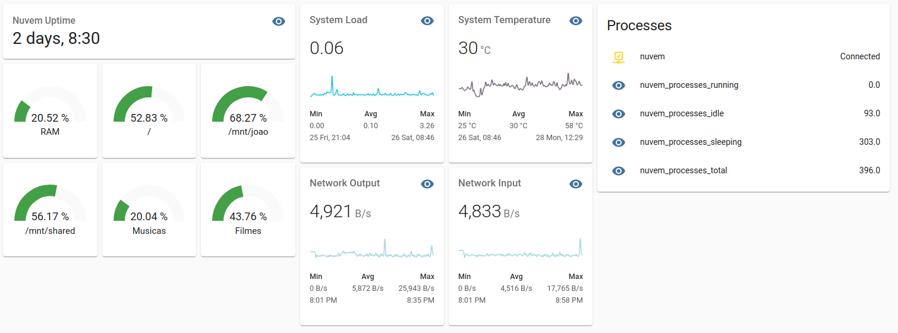

# Telegraf2Hassio

This addon will let you display Telegraf stats of a running instance directly on you Home Assistant dashboard, using self discoverable MQTT sensors.

Differently from most Telegraf integrations approaches out there, this addon does not need InfluxDB neither Grafana dashboards to display Telegraf's data.
Instead, it translates Telegraf's native MQTT messages into Home Assistant self-discoverable ones, such that it can detect and present your data with ease.

## Installation

To use this repository with your own Hass.io installation please follow [the official instructions](https://www.home-assistant.io/hassio installing_third_party_addons/) on the Home Assistant website with the following URL:

```txt
https://github.com/joaofl/hassio-addons
```

## Configuration

The available configuration options are as bellow. Make sure to edit
according to your setup:

```yaml
options:
  mqtt_broker: localhost
  mqtt_port: 1883
  mqtt_user: mqtt_user_here
  mqtt_pass: mqtt_pass_here
  telegraf_topic: telegraf/#
  calc_rate: host_sensor_measurement_1,host_sensor_measurement_2
  log_level: info
```

The `calc_rate` is an optional argument, but it allows to add calculated rate measurements on top of the measurements already provided by Telegraf.
For example, if you want know the data rate on a given ethernet port, then the `calc_rate` setting should look like below: 

```yaml
myserver_net_enp2s0_12_bytes_recv,nuvem_net_enp2s0_12_bytes_sent
```
where `myserver` is the Telegraf client name, `net` is the sensor name, `enp2s0_12` is the device name, followed by its unique ID (`12`), and finally the measurement name `bytes_sent`.
Having added the settings above to `calc_rate` (adapted to your setup names), another measurement will be announced via MQTT, with the same name ending with `_dt`, containing the calculated rate of change for that specific measurement. 
Multiple rate measurements can be added comma separated.

If you are not sure about the names to expect, start the addon, and check the logs after the first batch of data is received. It will show the host name, as well as of all sensors and measurements discovered.

## Example dashboard

Below an example dashboard I brought up real quick. I really hope to see some much cooler ones once some dedicated people start to play around with it.



Find also the source code to it [here](resources/example_dashboard.yaml)
